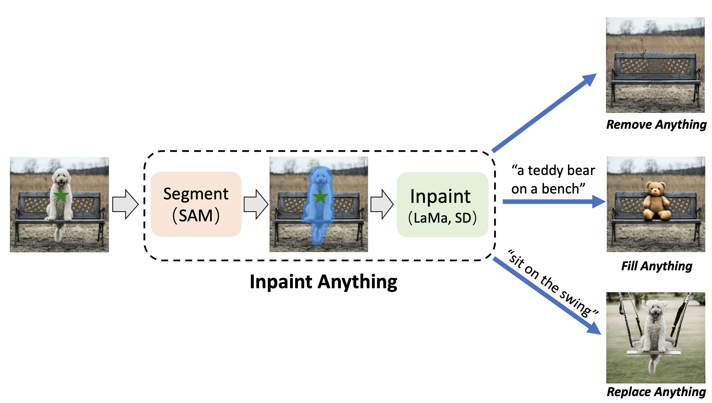
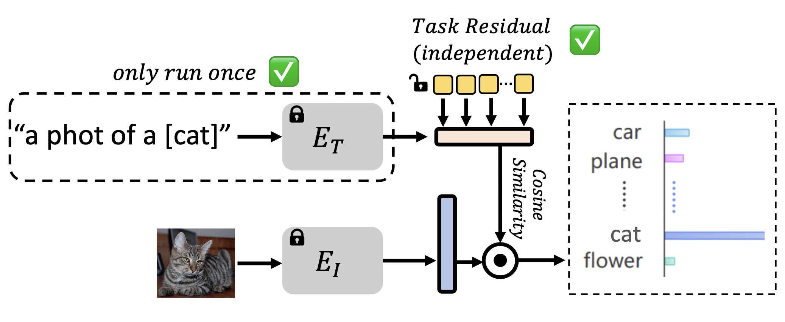
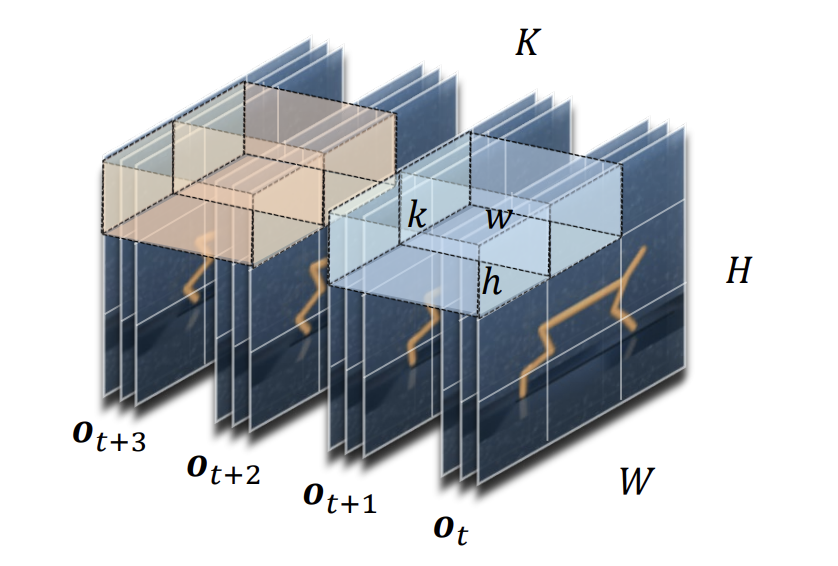
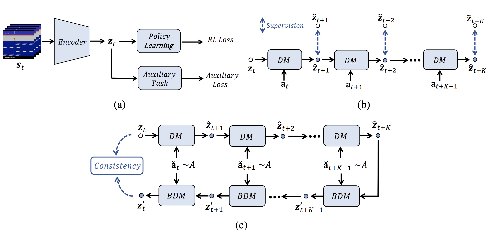
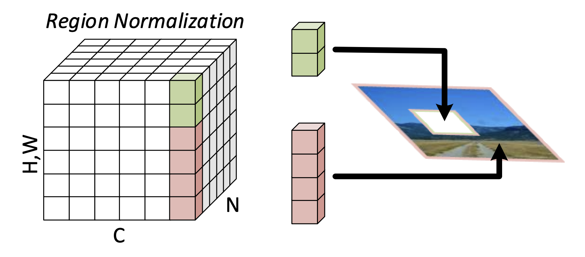
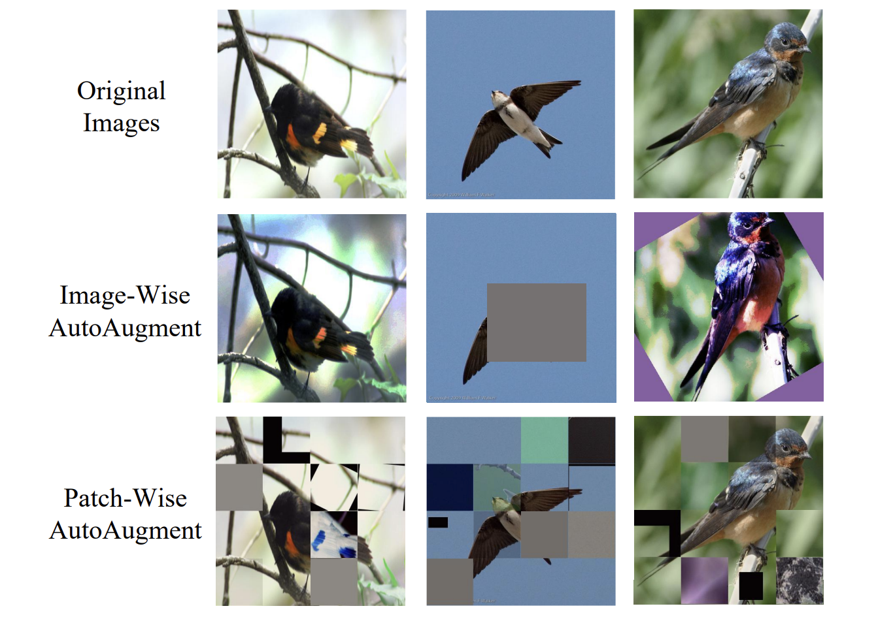
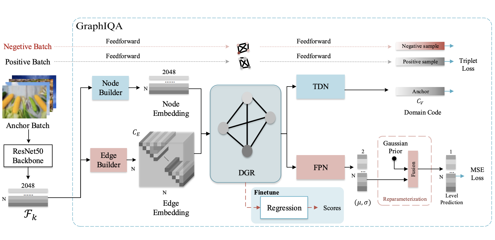

I am a Senior Researcher at Tencent, where I focus on reinforcement learning and game AI. My research interests lie in reinforcement learning, multimodal models, AIGC, etc. My final goal of research is to develop intelligent agents that can perceive, think and behave like humans.

Before my current role, I earned my Ph.D. in 2023 from the University of Science and Technology of China (USTC), under the guidance of Professors [Zhibo Chen](https://faculty.ustc.edu.cn/chenzhibo/) and [Weiping Li](https://ieeexplore.ieee.org/author/37349978300). Additionally, I was a Research Student at the National University of Singapore (NUS) from 2022 to 2023, where I worked with Prof. [Xinchao Wang](https://sites.google.com/site/sitexinchaowang/). Prior to that, I was a Research Intern at Microsoft Research Asia (MSRA) from 2020 to 2022, where I was mentored by Dr. [Cuiling Lan](https://www.microsoft.com/en-us/research/people/culan/) and Professor [Wenjun Zeng](https://www.eitech.edu.cn/?p=leader-Wenjun%20Zeng&tid=19&lang=en).

I like doing interesting projects. My recent project [Inpaint Anything](https://github.com/geekyutao/inpaint-anything) has received over 6.5k stars on GitHub. If you are interested in my work or want to collaborate, please feel free to contact me via email (yutao666@mail.ustc.edu.cn).

Selected Publications
------

  
  

    <a href="https://arxiv.org/pdf/2304.06790">Inpaint Anything: Segment Anything Meets Image Inpainting</a> 
    <b>Tao Yu</b>, Runseng Feng, Ruoyu Feng, Jinming Liu, Xin Jin, Wenjun Zeng, Zhibo Chen  
    <em>Technical Report 2023</em>  
    <a href="https://github.com/geekyutao/Inpaint-Anything">Code</a>
  

  
  

    <a href="https://arxiv.org/pdf/2211.10277">Task Residual for Tuning Vision-Language Models</a> 
    <b>Tao Yu*</b>, Zhihe Lu*, Xin Jin, Zhibo Chen, Xinchao Wang  
    <em>CVPR 2023</em>  
    <a href="https://github.com/geekyutao/TaskRes">Code</a>
  

  
  

    <a href="https://arxiv.org/pdf/2201.12096">Mask-based Latent Reconstruction for Reinforcement Learning</a> 
    <b>Tao Yu*</b>, Zhizheng Zhang*, Cuiling Lan, Yan Lu, Zhibo Chen  
    <em>NeurIPS 2022</em>  
    <a href="https://github.com/microsoft/Mask-based-Latent-Reconstruction">Code</a>
  

  
  

    <a href="https://arxiv.org/pdf/2106.04152">PlayVirtual: Augmenting Cycle-Consistent Virtual Trajectories for Reinforcement Learning</a> 
    <b>Tao Yu</b>, Cuiling Lan, Wenjun Zeng, Mingxiao Feng, Zhizheng Zhang, Zhibo Chen  
    <em>NeurIPS 2021</em>  
    <a href="https://github.com/microsoft/PlayVirtual">Code</a>
  

  
  

    <a href="https://arxiv.org/pdf/1911.10375">Region Normalization for Image Inpainting</a> 
    <b>Tao Yu</b>, Zongyu Guo, Xin Jin, Shilin Wu, Zhibo Chen, Weiping Li, Zhizheng Zhang, Sen Liu  
    <em>AAAI 2020</em>  
    <a href="https://github.com/geekyutao/RN">Code</a>
  

  
  

    <a href="https://arxiv.org/pdf/2103.11099">Local Patch Autoaugment with Multi-Agent Collaboration</a> 
    Shiqi Lin*, <b>Tao Yu*</b>, Ruoyu Feng, Xin Li, Xiaoyuan Yu, Lei Xiao, Zhibo Chen  
    <em>IEEE Transactions on Multimedia 2023</em>  
    <a href="https://github.com/LinShiqi047/PatchAutoAugment">Code</a>
  

  
  

    <a href="https://arxiv.org/pdf/2103.07666">GraphIQA: Learning Distortion Graph Representations for Blind Image Quality Assessment</a> 
    Simeng Sun*, <b>Tao Yu*</b>, Jiahua Xu, Wei Zhou, Zhibo Chen  
    <em>IEEE Transactions on Multimedia 2023</em>  
    <a href="https://github.com/geekyutao/GraphIQA">Code</a>
  

(* indicates equal contribution)

Selected Awards and Competitions
------
<ul style="list-style-type: none; padding: 0;">
  <li><strong>2024</strong>   Tencent Knowledge Award</li>
  <li><strong>2023</strong>   Outstanding Ph.D Graduate of USTC</li>
  <li><strong>2023</strong>   AI Rising Star Award</li>
  <li><strong>2022</strong>   Champion of CVPR 2022 Challenge on Learned Image Compression (Perceptual Track)</li>
  <li><strong>2019</strong>   Champion of ICME 2019 Grand Challenge on Learning-Based Image Inpainting</li>
  <li><strong>2017</strong>   Honorable Prize of International Mathematical Contest in Modeling</li>
  <li><strong>2016</strong>   First Prize of China Undergraduate Mathematical Contest in Modeling</li>
</ul>

Service
------
Reviewer: NeurIPS, ICML, ICLR, CVPR, ICCV, ECCV, AAAI, TPAMI, IJCV, TMM, etc.

------
ClustrMaps Embed Code

  

    
  

  

    <!-- Google tag (gtag.js) -->
  
  
  

